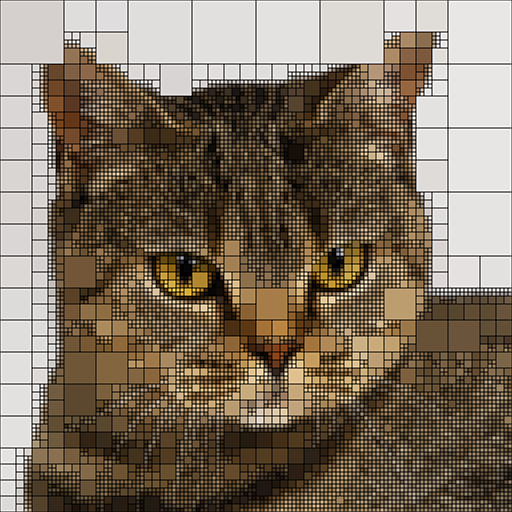

# quadTreeArt
Generate art with quadtree from image.  

1st argument - path to image 
2nd argument - min square size 
3rd argument - integer threshold - more squares if it's small (default is 45)  
-o for black outline  
-c for circles instead of squares
-m for mosaic
```
java quad cat.jpeg 4 50 -o
```


